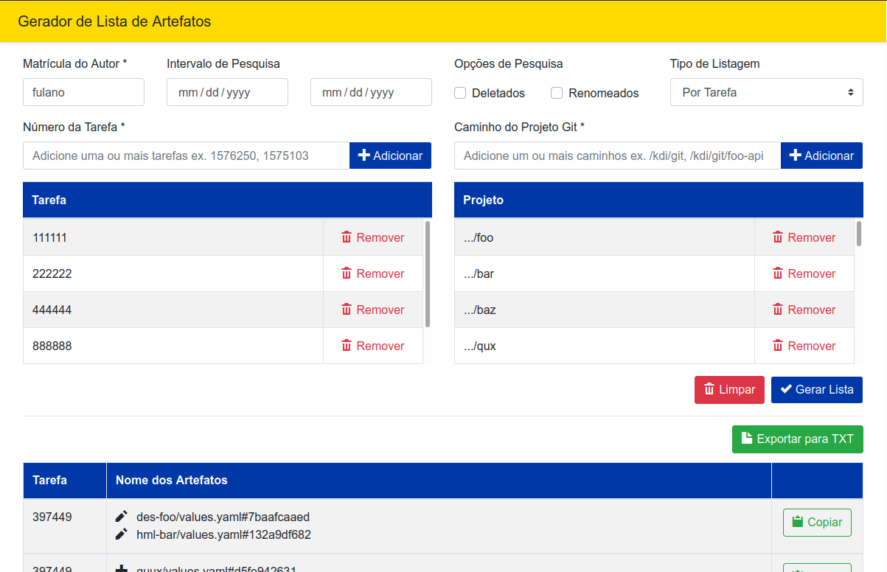

# Gerador de Lista de Artefatos

App para listar os artefatos incluídos/alterados/renomeados/removidos para geração do orçamento de OF

## Pré-requisitos 

### Sistema

- Git versão mínima v2.17
- Navegador Firefox

### Git

- Executar o comando `git pull --all` antes de usar o script
- Se certificar que foi executado o `git push` dos commits locais (o gerador só lista os commits que estão no repositório remoto) 
- Não utilizar espaços nos nomes dos arquivos
- Configurar corretamente as variáveis do Git `user.name` e `user.email` com matrícula e email
- Caso seja utilizado o git via linha de comando, utilizar o comando `git mv` para renomear os artefatos
- Utilizar o seguinte formato nas mensagens de commit:
  - `task 123456 - Mensagem do commit`
  - `task 123456 Mensagem do commit`
  - `123456 - Mensagem do commit`
  - `123456 Mensagem do commit`

## Download 

- [Linux](https://github.com/diegomdrs/gerador-lista-artefato/releases/download/0.0.7/gerador-lista-artefato-lin)

- [Windows](https://github.com/diegomdrs/gerador-lista-artefato/releases/download/0.0.7/gerador-lista-artefato-win.exe)

- [Mac](https://github.com/diegomdrs/gerador-lista-artefato/releases/download/0.0.7/gerador-lista-artefato-mac)

## Utilização

### Windows

Para utilizar o gerador na versão para Windows, baixe o executável e clique duas vezes no mesmo.

### Linux

Na primeira utilização da versão Linux, execute:

~~~ console
$ chmod +x gerador-lista-artefato-lin
~~~
Em seguida, execute o comando:

~~~ console
$ ./gerador-lista-artefato-lin
~~~
### Mac

Na primeira utilização da versão Mac, execute:

~~~ console
$ chmod +x gerador-lista-artefato-mac
~~~
Em seguida, execute o comando:

~~~ console
$ ./gerador-lista-artefato-mac
~~~
## Modo Interface Web

Ao executar os passos anteriores, será aberto o endereço [http://localhost:3333/gerador](http://localhost:3333/gerador), conforme a imagem abaixo

## Modo CLI

### Linux e Mac

~~~ console
$ ./gerador-lista-artefato --diretorio=/kdi/git --projeto=foo-estatico,foo-api --autor=X1337 --task=900089,900081
~~~

### Windows

~~~ console
$ ./gerador-lista-artefato.exe --diretorio=C:/kdi/git --projeto=foo-estatico,foo-api --autor=X1337 --task=900089,900081
~~~

### Parâmetros do modo CLI

~~~ console
  -s, --server               Inicia a versão server e ignora os outros parâmetros (default: true)
  -d, --diretorio <type>     Diretório raiz dos projetos Git
  -p, --projeto <type>       Lista de projetos Git (podem ser passados vários projetos separados por vírgula)
  -a, --autor <type>         Matrícula do autor dos commits
  -t, --task <type>          Lista de tarefas (podem ser passadas várias tarefas separadas por vírgula)
  -l, --listagem <type>      Tipo da listagem POR_TIPO_ARTEFATO ou POR_TAREFA (Opcional) (default: "POR_TAREFA")
  --mostrar-num-modificacao  Nº de modificações do artefato na tarefa ou tarefas (Opcional)
  --mostrar-deletados        Mostra artefatos deletados na tarefa (Opcional)
  --mostrar-renomeados       Mostra artefatos renomeados na tarefa (Opcional)
  --mostrar-commits-locais   Mostra commits remotos e locais (Opcional)
  -v, --version              Mostra a versão do programa
  -h, --help                 output usage information
~~~

### Saida do gerador em modo CLI

~~~ console
$ ./gerador-lista-artefato-lin --diretorio=/kdi/git --projeto=foo-estatico,foo-api --autor=X1337 --task=900089,900081 --mostrar-deletados --mostrar-num-modificacao --mostrar-deletados --mostrar-renomeados

Tarefa nº 900089

M   2   foo-api/src/main/java/br/com/foo/api/v1/foo/gateway/GatewayConsultarFoo.java#09e0003
M   3   foo-api/src/main/java/br/com/foo/api/v1/foo/gateway/GatewayIncluirFoo.java#09e0003
M   1   foo-estatico/Gruntfile.js#09e0003
M   1   foo-estatico/karma.conf.js#72a28f1
M   1   foo-estatico/package.json#72a28f1

Tarefa nº 900089

A   1   foo-api/src/main/java/br/com/foo/api/v1/foo/gateway/GatewayIncluirFoo.java#e73b22c

Tarefa nº 900089

R   1   foo-estatico/foo.json foo-estatico/bar.json

Tarefa nº 900089

D   1   foo-estatico/src/app/spas/foo/detalha-foo.tpl.html#e73b22c

~~~
Onde:

- Ação executada no artefato ou na lista de artefatos - A (Added), M (Modified), R (Renamed) e D (Deleted)
- Nº de modificações do artefato na tarefa - se utilizado o parâmetro `--mostrar-num-modificacao`
- Caminho do artefato

### Exemplo de uso

~~~ console
$ ./gerador-lista-artefato-win.exe --diretorio=C:/kdi/git --projeto=foo-estatico,foo-api --autor=X1337 --task=900077,900079

Tarefas nº 900077, 900079

M      foo-estatico/Gruntfile.js#e73b22c

Tarefa nº 900077

A      foo-estatico/src/app/spas/foo/inclusao-foo.tpl.html#e73b22c

Tarefa nº 900077

M      foo-estatico/src/app/spas/foo/inclusao-foo.tpl.html#e73b22c
M      foo-estatico/src/app/spas/foo/altera-foo.tpl.html#7749089

Tarefa nº 900079

M       foo-api/pom.xml#7749089
M       foo-api/operacoes.xml#7749089

~~~
